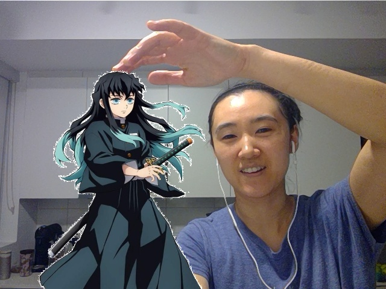

# take-picture-w-anime-character
this app allow you take picture with your favorite animation character

## hardware requirement:
  a computer with front webcam
  
## usage:
1. open terminal
2. pip install opencv-python
3. python main.py
4. when you ready to take the picture, press Esc key
5. the picture will be saved as result.jpg in root directory (the same as main.py)

## explain
choose an image as template.  the white pixels in this image will be replaced by the frame captured by webcam.
sample template:

sample result:

