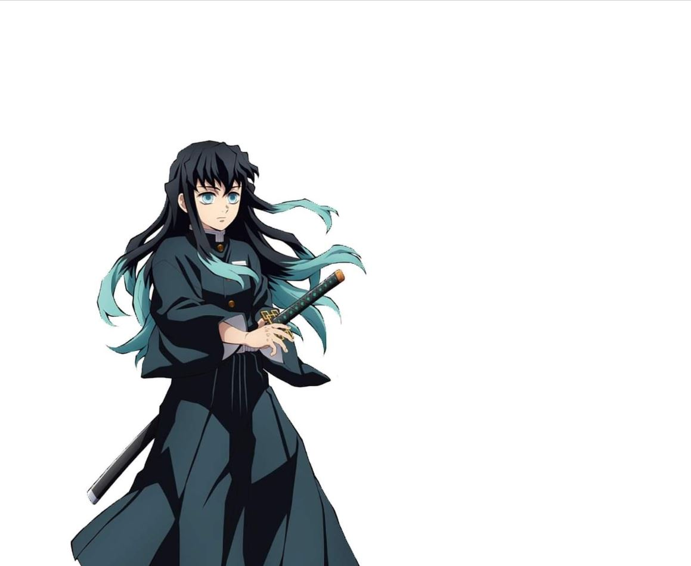

# take-picture-w-anime-character
this app allow you take picture with your favorite animation character

## hardware requirement:
  a computer with front webcam
  
## usage:
1. open terminal
2. pip install opencv-python
3. put your template image in the same path as main.py, specigy its name by replacing 'intput_img' in main.py
4. python main.py
5. when you ready to take the picture, press Esc key
6. the picture will be saved as result.jpg in root directory (the same as main.py)

## explain
choose an image as template.  the white pixels in this image will be replaced by the frame captured by webcam.  **Be creative about the template images!**

sample templates:

  
  
  

sample result:

  
  
  

**Enjoy!**
